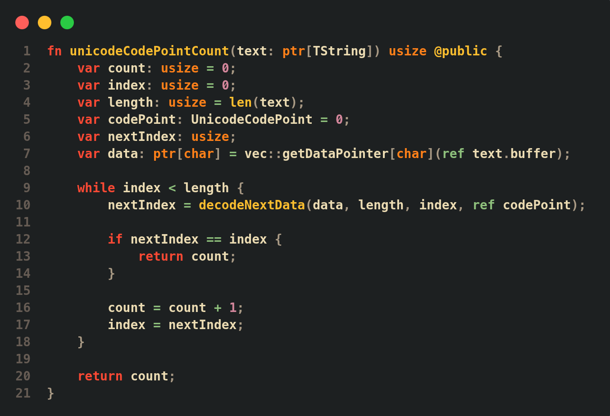

# Syntax Highlighting

Thrust Programming Language includes syntax highlighting support for VS Code and Neovim/Vim, including editor integration, file icons, and optional themes.

## VS Code

Install the extension from the generated VSIX package:

```bash
code --install-extension highlighting/vscode/thrustlang-highlighting-0.2.1.vsix
```

The extension includes Thrust syntax highlighting, file icons, and the available editor themes.

## Neovim/Vim

Use the bundled plugin located at:

```text
highlighting/neovim/thrust.nvim/
```

Copy the plugin folders into your Neovim configuration:

```bash
cp -r highlighting/neovim/thrust.nvim/ftdetect ~/.config/nvim/
cp -r highlighting/neovim/thrust.nvim/ftplugin ~/.config/nvim/
cp -r highlighting/neovim/thrust.nvim/syntax ~/.config/nvim/
cp -r highlighting/neovim/thrust.nvim/colors ~/.config/nvim/
```

Open any `.thrust` file and highlighting will be enabled automatically.

To use the included Gruvbox Dark Hard theme:

```vim
:colorscheme thrust-gruvbox-dark-hard
```

## Example


